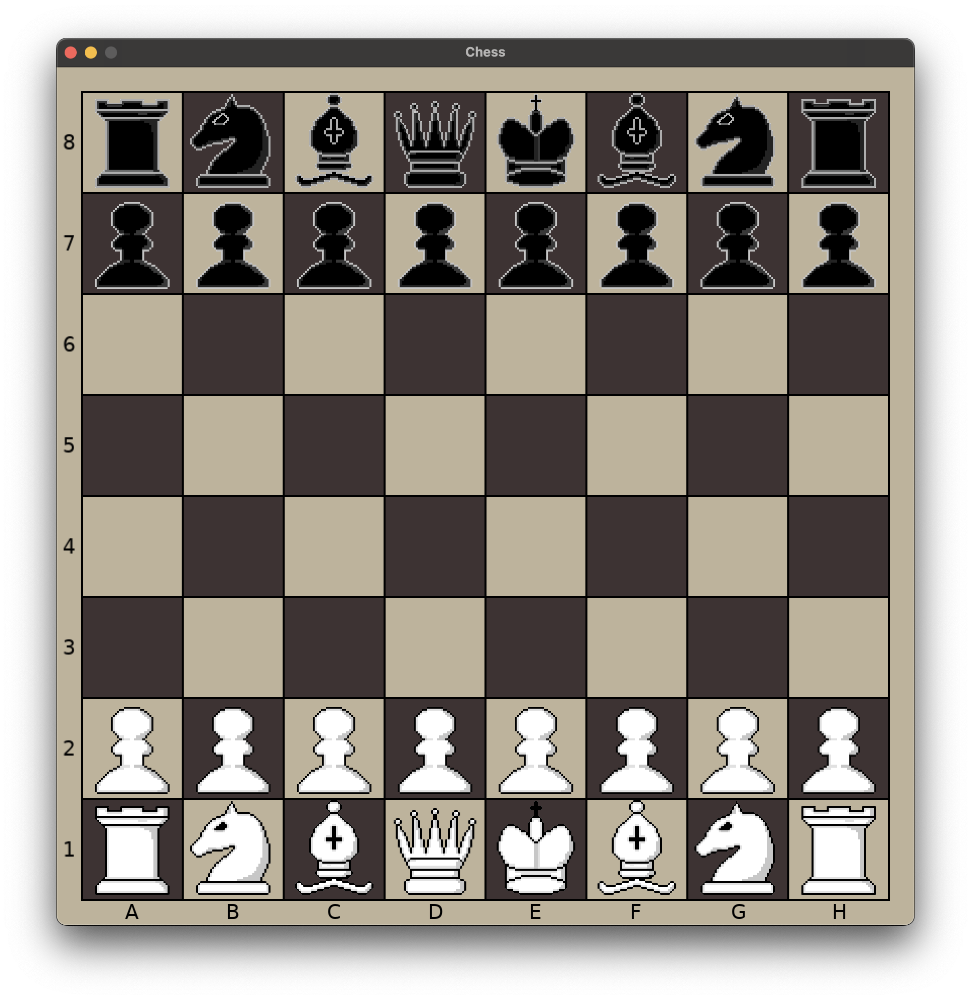

# CHESS-client

A chess client written in Lua for the [Löve](https://love2d.org/) framework, using the [ENet](https://leafo.net/lua-enet/) module for communication between the client and the local [server](https://github.com/Waissi/chess-server)  

## Dependencies

[json.lua](https://github.com/rxi/json.lua) (included)

## Installation

You need to install Löve and have it in your path, then simply run
```
love .
```

